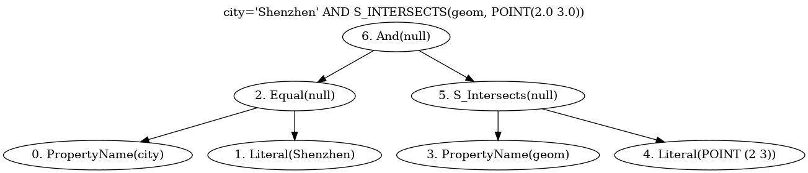

# Cql2Cpp
Cql2Cpp is a C++ library that implements the parsing and evaluation of OGC CQL2(Common Query Language).
https://www.ogc.org/publications/standard/cql2/



# History
Syrius Robotics has been focused on developing applications for indoor robots, which led us to create an indoor geographic information system. At the end of 2024, while working on this system, we recognized the need for a filter language to help robots query indoor features more efficiently. Around that time, OGC CQL2 had just been released, but there were no existing C++ libraries available for it. As a result, Syrius Robotics decided to develop their own solution.

# Progress and Plan
As of the end of 2024, only a limited number of syntax features have been developed, including the most basic field operations and a small set of spatial operations. This library is not recommended for use in any production environment or product.

We plan to complete all the requirements specified in Requirement 1 "/req/basic-cql2/cql2-filter"([Clause 6.2](https://docs.ogc.org/is/21-065r2/21-065r2.html#basic-cql2_filter-expression)) of CQL2, along with a subset of spatialPredicate, by early 2025.

In the second quarter of 2025, we completed the parsing of almost all features except those related to time and Unicode encoding. Additionally, we plan to translate the parsing results into the WHERE clause of the SQL language.

| feature | parsing | evaluation | SQL |
| ---- | ---- | ---- | ---- |
| bool expression | &check; | &check; | &check; |
| isInList predicate | &check; | &check; | &check; |
| array predicate and all array functions | &check; | &check; | &check; |
| comparison operator | &check; | &check; | &check; |
| geom expression (including BBOX) | &check; | &check; | &check; |
| spatial predicate | &check; | &check; | &check; |
| property name | &check; | &check; | &check; |
| function | &check; | &check; | &#10008; |
| isLike predicate | &check; | &#10008; | &check; |
| isBetween predicate | &check; | &#10008; | &check; |
| numeric expression | &check; | &#10008; | &check; |
| isNull predicate | &check; | &#10008; | &check; |
| pattern expression | &check; | &#10008; | &check; |
| non-ascii charactor literal | &#10008; | &#10008; | &#10008; |

you can find a full list of features supported here:
https://github.com/orgs/IndoorSpatial/projects/1/views/1

# SQL
| CQL2 | SQL WHERE clause |
| ---- | ---- |
| wind_speed > 2 * 3 + 4 | "wind_speed" > 2 * 3 + 4 |
| city='Shenzhen' | "city" = 'Shenzhen' |
| value=field^2 | "value" = POWER("field",2) |
| "value" IN (1.0, 2.0, 3.0) | "value" IN (1.000000,2.000000,3.000000) |
| owner NOT LIKE '%Mike%' | "owner" LIKE '%Mike%' |
| "value" IS NULL OR "value" BETWEEN 10 AND 20 | "value" IS NULL OR "value" BETWEEN 10 AND 20 |
| A_CONTAINS(layer:ids, ('layers-ca','layers-us')) | "layer:ids" NOT NULL AND NOT EXISTS (<br>  VALUES ('layers-ca'),('layers-us')<br>  EXCEPT<br>  SELECT value FROM json_each("layer:ids")<br>) |
| S_INTERSECTS(geom,POINT(36.3 32.2)) | ST_Intersects("geom",ST_GeomFromText('POINT (36.3 32.2)')) |
| S_WITHIN(location,BBOX(-118,33.8,-117.9,34)) | ST_Within("location",<br>ST_GeomFromText('POLYGON(-118 33.8,-117.9 33.8,-117.9 34,-118 34,-118 33.8)')) |
| T_BEFORE(built, DATE('2015-01-01')) | **(UNSUPPORTED)** |

# command line interface
parse a CQL2 query and print dot file
```bash
./cql2 parse "value=2+3"
```

parse a CQL2 query and save dot to file
```bash
./cql2 parse "value=2+3" -O query.dot
```

convert CQL2 to SQL WHERE clause
```bash
./cql2 sql "value=2+3"
```

other usefull command
```bash
./cql2 --help
./cql2 --version
```

# Dependencies
1. flex: lexer
2. bison: parser
3. gflags: for cli tool
4. glog: for logging
5. geos: for geometry and spatial predicate and geojson
6. gtest: for unit test

# Build

## build locally
```bash
sudo apt-get install -y build-essential g++-aarch64-linux-gnu
sudo apt-get install -y flex bison
sudo apt-get install -y libgflags-dev libgoogle-glog-dev libgtest-dev libgeos++-dev
mkdir build && cd build
cmake ..
make -j16
suto apt-get install -y libsqlite3-dev libspatialite-dev
ctest

```

## build by conan
```bash
sudo apt-get install -y build-essential g++-aarch64-linux-gnu
sudo apt-get install -y flex bison
pip install conan
cd cql2cpp
conan install . --build=missing --output-folder build
cd build
cmake .. -DCMAKE_BUILD_TYPE=Release -DCMAKE_PREFIX_PATH=build -DCMAKE_MODULE_PATH=build
make -j16
```

## build in docker
```bash
docker run --rm -it -v path/to/cql2cpp:/home/ubuntu/cql2cpp/ kunlinyu/cql2cpp:latest bash
docker$ cd cql2cpp
docker$ mkdir build && cd build
docker$ cmake ..
docker$ make -j16
ctest
```
